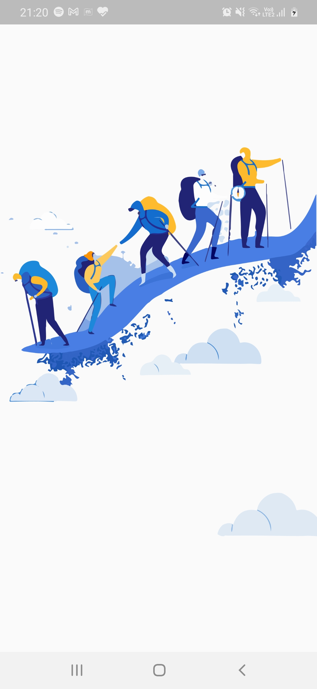
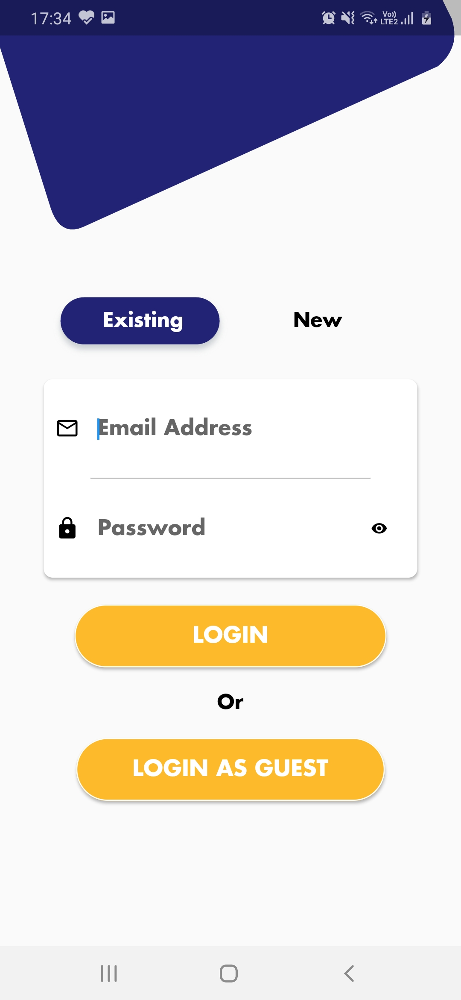
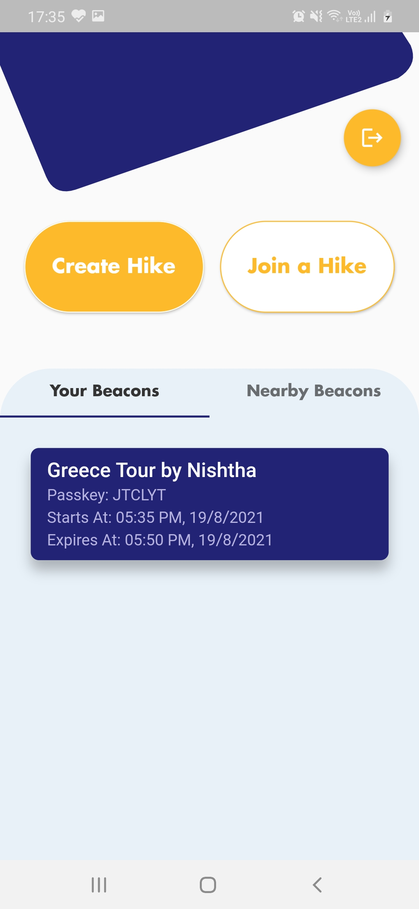
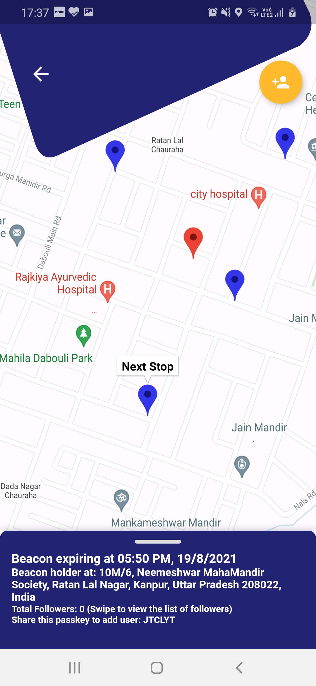
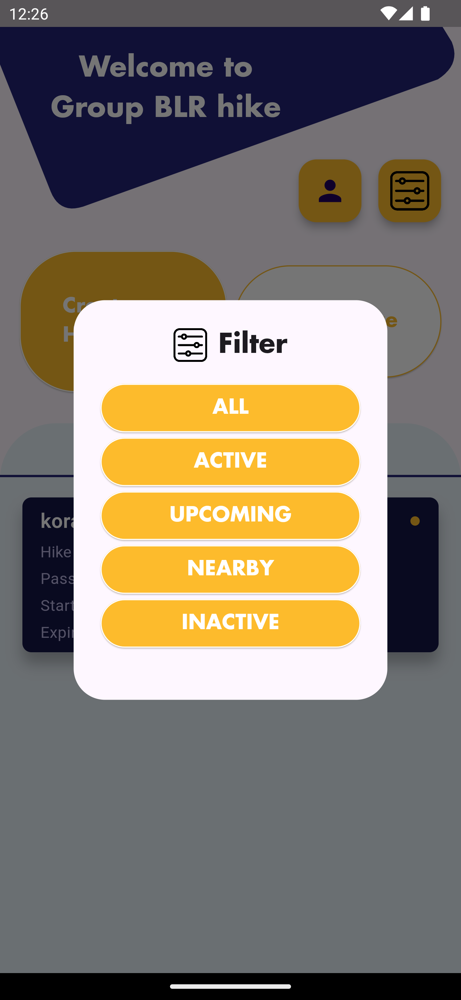
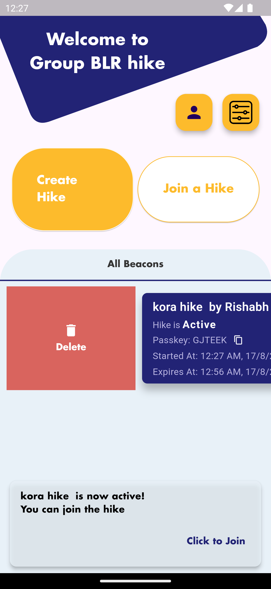
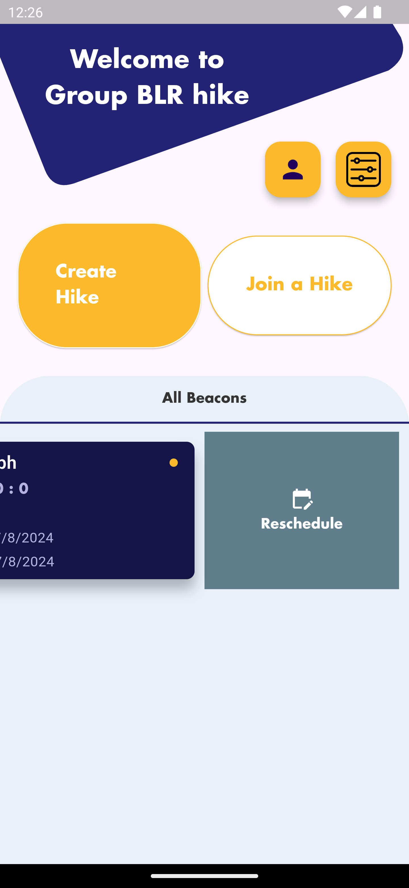
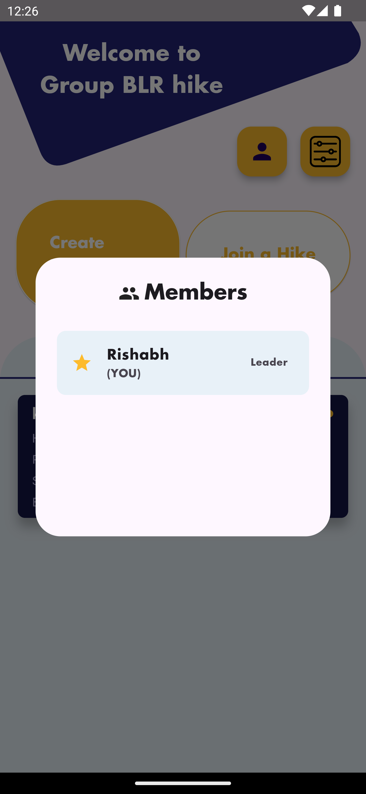
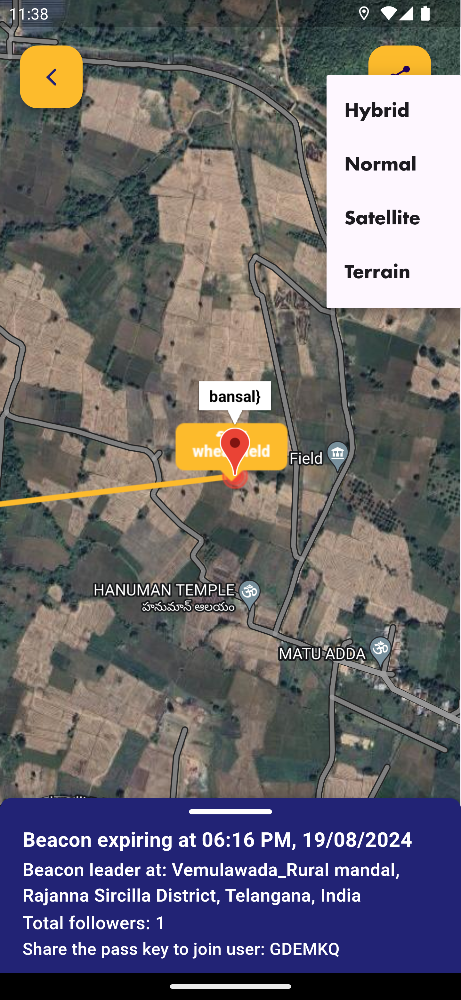
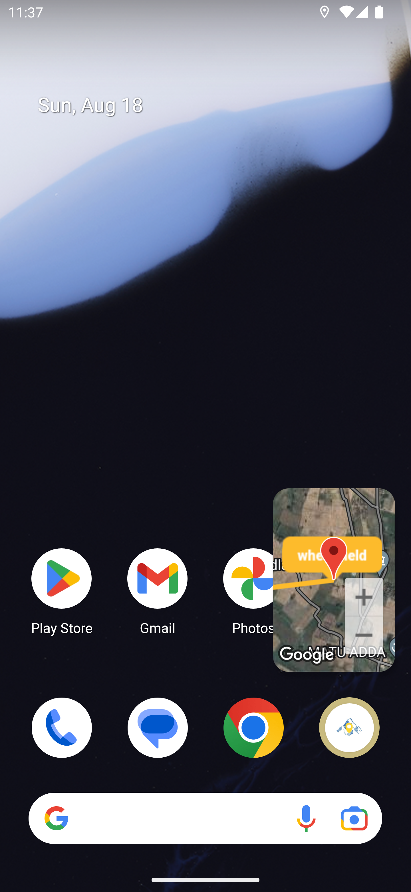

# Beacon
[](https://github.com/CCExtractor/beacon/actions/workflows/flutter-ci.yml)

## Official Documentation
https://ccextractor-beacon-docs.netlify.app/

The source code of documentation can be found here: https://github.com/CCExtractor/Beacon-Documentation

## About the Project

This project is a flutter build native interface to ease the group travelling (or hiking). By using this, the group leader would be able to share his location with the entire crew, and in case if someone loses contact with the group, he can quickly get in the right place by following the beacon.

## Getting Started

You can test Beacon in your own development environment. This section shows you how:

### Prerequisites

You'll need to set up the IDE and mobile device emulator, or any mobile testing device on your local system.

**Flutter Environment**: You'll need to have the following installed:
1. [Flutter SDK](https://flutter.dev/docs/get-started/install)
2. [Android Studio](https://developer.android.com/studio)

***Ensure you are testing the app using Flutter version [3.0.1](https://docs.flutter.dev/development/tools/sdk/releases?tab=windows) and above.***

For checking flutter version:
- Run `flutter --version` in terminal

If your version is not upto date, follow these steps to upgrade:
- `flutter channel stable` to switch to the channel having stable version of flutter updates
- `flutter upgrade` to get the latest flutter version

**Development Environment**: For setting up the development environment, follow the steps given below.

- Clone this repository after forking using `git clone https://github.com/<username>/beacon.git`
- `cd` into `beacon`
- Check for flutter setup and connected devices using `flutter doctor`
- Get all the dependencies using `flutter pub get`
- Create a .env file in the root folder, copy the content from .env.example and add respected key's value
- Run the app using `flutter run`

For help getting started with Flutter, view our
[online documentation](https://flutter.dev/docs), which offers tutorials,
samples, guidance on mobile development, and a full API reference.

## Project Structure

This project follows Clean architecture with following structure:

```bash
beacon/
├── lib/
│   ├── config/                         # Configuration files
│   ├── core/                           # Core application logic
│   ├── data/
│   │   ├── datasources/
│   │   │   ├── local/                  # Local data sources
│   │   │   └── remote/                 # Remote data sources
│   │   ├── models/                     # Data models
│   │   └── repositories/               # Data repositories
│   ├── domain/
│   │   ├── entities/                   # Domain entities
│   │   ├── repositories/               # Domain repositories
│   │   └── usecases/                   # Domain use cases
│   ├── presentation/
│   │   ├── auth/
│   │   │   ├── cubit/                  # Authentication Cubit
│   │   │   ├── widget/                 # Authentication widgets
│   │   │   └── screen/                 # Authentication screens
│   │   ├── home/
│   │   │   ├── cubit/                  # Home Cubit
│   │   │   ├── widget/                 # Home widgets
│   │   │   └── screen/                 # Home screens
│   │   ├── group/
│   │   │   ├── cubit/                  # Group Cubit
│   │   │   ├── widget/                 # Group widgets
│   │   │   └── screen/                 # Group screens
│   │   ├── hike/
│   │   │   ├── cubit/                  # Hike Cubit
│   │   │   ├── widget/                 # Hike widgets
│   │   │   └── screen/                 # Hike screens
│   │   ├── widgets/                    # Shared widgets used across all presentation folders
│   │   └── splash_screen.dart          # Initial screen displayed while loading
├── main.dart                           # App entry point
├── theme/                              # Theme configurations
├── locator.dart                        # Dependency injection setup (using get_it)
├── router.dart                         # App navigation routes
```

## Screenshots

   

   

  

## Contributing

Whether you have some feauture requests/ideas, code improvements, refactoring, performance improvements, help is always Welcome. The more is done, better it gets.

If you found any bugs, consider opening an [issue](https://github.com/CCExtractor/beacon/issues/new).

**To know the details about features implemented till Google Summer of Code'21 and future todo's please visit [this blog](https://blog.nishthab.tech/gsoc-2021-ccextractor-beacon)**

## Community

We would love to hear from you! You may join gsoc-beacon channel of CCExtractor community through slack:

[](https://ccextractor.org/public/general/support/)
